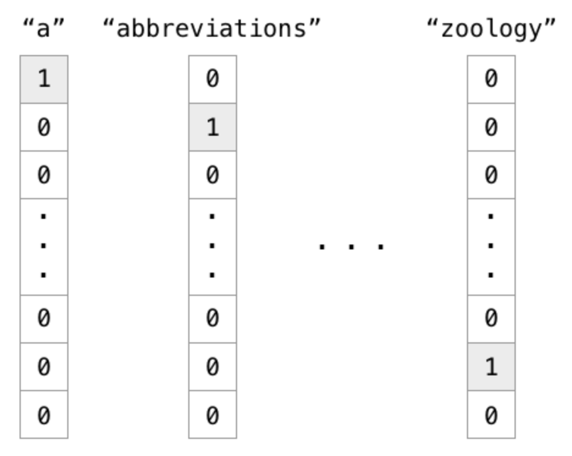
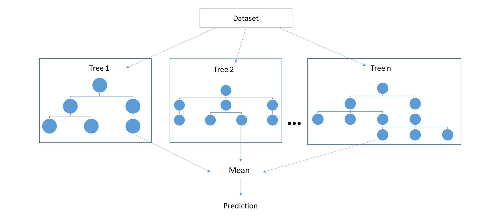
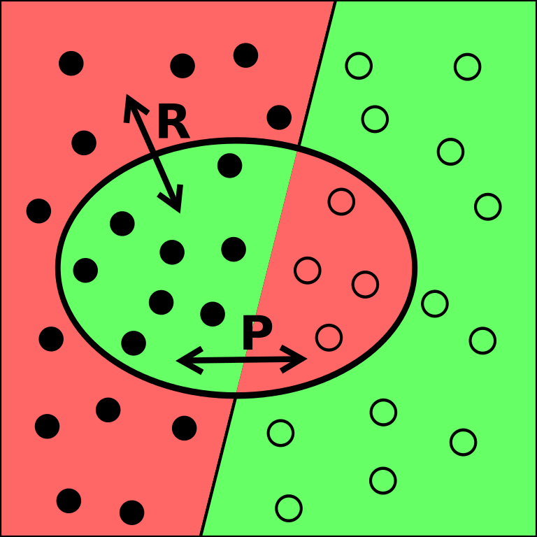

class: center, top, and title-slide
background-image: url("images/bg.png")
background-position: top
background-size: contain

```{r setup, include=FALSE}
options(htmltools.dir.version = FALSE)
```

# Deep learning algorithms for<br>automatic classification of<br>electronic medical records<br>starting from free text

**Corrado Lanera**\*<sup>1</sup>, Elisa Barbieri<sup>2</sup>, Gianluca Piras<sup>1</sup>, Arjun Maggie<sup>3</sup>, Davy Weissenbacher<sup>3</sup>, Daniele Dona<sup>2</sup>, Luigi Cantarutti<sup>4</sup>, Graciela Gonzalez<sup>3</sup>,<br>Carlo Giaquinto<sup>2,4</sup>, and Dario Gregori<sup>1</sup>

.left[
<small><small>
2019/10/22 - @University of Torino - Department of Clinical and Biological Sciences<br><br>
\*<corrado.lanera@unipd.it><br>Biomedicine Data Mining and Artificial Intelligence Lab
</small></small><br><br><br>
]


.left[
<small>
<small>
<small>
<small>
<sup>1</sup> Unit of Biostatistics, Epidemiology, and Public Health of the Department of Cardiac-Thoracic-Vascular Sciences and Public Health – University of Padova<br>
<sup>2</sup> Division of Pediatric Infectious Diseases, Department for Woman and Child Health, University of Padua, Padua, Italy<br>
<sup>3</sup> Health Language Processing Center, Institute for Biomedical Informatics of the Perelman School of Medicine – University of Pennsylvania<br>
<sup>4</sup> Società Servizi Telematici – Pedianet<br>
</small>
</small>
</small>
</small>
]


???

Good moarning, I am Corrado Lanera and I have just finished my third
year Ph.D. at the Unit of Biostatistics, Epidemiology and Public Health,
at the University of Padova.

Today I will present you an **overview of the final work** inlcuded in my 
dissertation, that aims to identify and classsify different types of 
otitis automatically and using only free-text from prediatric medical 
reports. 

This is a **joint work with** three other groups:
 
 - the **Pedianet** society which collected and provided the data;
 - the **Division of Pediatric Infectious Diseases** of the university
   of Padova which created the gold standard, motivated the study and 
   analyzed the results from the clinical point of view
   
 - and **Health Language Processing Center** at the University of
   Pennsylvania, in wich I have spent my visiting period during the
   Ph.D., and where I have developed all the computational aspects of 
   the analyses
   


---
class: inverse, middle
# Outline

1. **Overview**: otitis

1. **Database and Task**: 

1. **Programming paradigms**: classical and machine learning

1. **Classical text classification** search string and regular expression

1. **Shallow machine learning**: document-text matrix

1. **Neural networks**: basics

1. **Embeddings**: dense representation of text

1. **Deep networks**: convolutions, sequential/recurrent

1. **Task & metrics**: multi-class, scores and human-performances

1. **Analyses plan**: flowchart

1. **Our approach**: architectures explored

1. **Results, final remarks and conclusions**


???

So, we will start with a quick overview on the otitis and the importance
of their classification.

Next, we will describe which classes we are interested to classify and 
we will explore the main details of the database we used.

To evaluate any models, we need some metrics, so, before to describe the
flowchart we adopted for the analyses, we will explore teh metrics and 
the reference we considered.

After that we will show the deep-learning architectures explored and 
trained to create teh final ensamble model.

At the end we conclude reporting the results achieved, concluding with 
some highlights.


---
class: center, middle, inverse
# **Overview**<br>classification of otitis


---
class: middle


- one of the most common infections in pediatrics
  
- the main cause of antibiotic prescriptions

- challenging diagnosis

- frequently, little attention is paid to the guidelines

- continuing interest in defining the incidence and burden of AOM

.right[
<br>
<small><small><small><small>https://commons.wikimedia.org/wiki/File:Otitis_Media.png</small></small></small></small>
<br>
<small><small><small><small>\*Marchisio P. et al. "Burden of acute otitis media in primary care pediatrics in Italy: a secondary data analysis from the Pedianet database", **BMC Pediatrics** 2012.</small></small></small></small>
<br>
<small><small><small><small>\*Spiro DM, Arnold, DH. "The concept and practice of a wait-and-see approach to acute otitis media.", **Current Opinion in Pediatrics** 2008</small></small></small></small>
]


???

- Otitis media is one of the **most common infections in pediatrics**
  population.

- It is an **inflamamtion with possible fluid accumulation** in the
  middle ear

- and there is continuing interest in defining the incidence and the
  burden of acute cases, being one of the main cause of antibiotics
  prescriptions in children.
  
- This is also highlighted by the **chellenges in the diagnoses** and by 
the **frequently little attention in following the guidlines**, like the
**wait-and-see approach** that discourage early antibiotics prescription,
reducing their usage and the adverse events associated with that.


---
class: center, middle, inverse
# **Database and Task**<br>


.center[A. Kao, S. Poteet (2007) **Text Mining: the discovery and the extraction of
interesting, non-trivial knowledge from free or unstructured
text.**]


---
class: middle

.center[]

<big>
**snapshot considerd**: from 1st January 2004 to 23rd August 2017

**records**: $6,903,035$ $( 297,373$ filtered by a search string $)$

**pediatricians**: $144$ (troughout Italy)

**children**: $216,976$

**fields** (all free-text, Italian-language):
- diagnosis
- signs-and-symptoms
- diary
- prescription
- visit description
- visit result


---
class: middle


<big><big>

2019  investigation

- data from 2010 to 2015 

- **on primary diagnosis only**

Adding even the diaries in a traditional manual human-driven analysis proved to be 
**too costly** in terms both of person-time and economic resources


It is necessary to develop an **accurate** system able to classify all
the  records **automatically** investigating **all the textual
fields** in the database.

<small><small><small><small><small><small>\*Barbieri et.al "Antibiotic prescriptions in acute otitis media and pharyngitis in Italian pediatric outpatients", **Italian J. of Pediatrics** 2019</small></small></small></small></small></small>


???

Pedianet was investigated in 2019 by Barbieri et.al\* on data from 
2010 to 2015 for similar task **on primary diagnosis only**: adding even
the diaries in a traditional manual human-driven analysis proved to be 
too costly in terms both of person-time (years) and economic resources

It is necessary to develop an **accurate** system able to classify all
the Pedianet records **automatically** investigating **all the textual
fields** in the database.


---
class: center, middle, inverse
# **Programming paradigms**<br>classical and machine learning


---
class: middle, center


Arthur Samuel (1959). **Machine Learning: Field of study that gives computers the ability to learn without being explicitly programmed.**


---
class: center, middle, inverse
# **Classical text classification**<br>Search string and regular expression


---
class: center, middle


.pull-left[
# Search string

One or several strings (also called patterns) founded within a larger string or text.


<small><small><small><small><small><small><small>
<https://upload.wikimedia.org/wikipedia/commons/thumb/8/85/MeSH-example.svg/1024px-MeSH-example.svg.png>
</small></small></small></small></small></small></small>


<small><small><small><small><small>
<https://it.wikipedia.org/wiki/File:Boolean_operations_on_shapes.png>
</small></small></small></small></small>
]


.pull-right[
# Regular expressions

A sequence of characters that define a search pattern


<br><br>
<small><small><small>
<https://www.flickr.com/photos/bluesmoon/8458343489/in/photostream/>
</small></small></small>
]


---
class: center, middle, inverse
# **Shallow machine learning**<br>document-text matrix
---
class: middle

# Preprocessing

- **removing** (removes noise):
  - remove non-word text
  - remove stopwords
  - strip whitespace

- **merging** (reduce the risk to allow important information to become noise because they are dispersed):
  - lowering
  - stemming
  - lemmatization

- **producing** (from words to “tokens”, i.e. single indivisible piece of information to bring information which could be lost otherwise, e.g. negations):
  - n-Grams (consecutive sequences of n words)

---
class: middle

# Sparse representation



<small><small><small>
<https://towardsdatascience.com/word-embedding-with-word2vec-and-fasttext-a209c1d3e12c>
</small></small></small>

---
class: middle

# Document-term matrix


---
class: middle


<small><small><small>.right[
<https://vinodsblog.com/2018/11/08/classification-and-regression-demystified-in-machine-learning/>]


---
class: middle, center

# (Shallow) Model definition
.pull-left[
Logistic regression 


<small><small><small><small>
<https://commons.wikimedia.org/wiki/File:Exam_pass_logistic_curve.jpeg>
</small></small></small></small>


k-nearest neighbor


<small><small><small>
<https://it.m.wikipedia.org/wiki/File:KnnClassification.svg>
</small></small></small>
]


.pull-right[
support-vector machine


<small><small><small>
<https://commons.wikimedia.org/wiki/File:Kernel_Machine.png>
</small></small></small>

random forest (decision tree)


<small><small><small><small><small><small>
<https://towardsdatascience.com/random-forests-and-decision-trees-from-scratch-in-python-3e4fa5ae4249>
]


---
class: center, middle, inverse
# **Neural networks**<br>basic structure

---
class: center, middle


# (Artificial) Neuron


<small><small><small><small>
.right[<https://www.cs.iusb.edu/~danav/teach/c463/12_nn.html>]
</small></small></small></small>

<br>
<big>
<big>
<big>
<big>
$=g(\sum(w_ia_i))$


---
class: center, middle

# Fully connect


<small><small><small>
<https://upload.wikimedia.org/wikipedia/commons/thumb/e/e4/Artificial_neural_network.svg/860px-Artificial_neural_network.svg.png>


---
class: top

# .center[Learning]

.center[Tom Mitchell (1998). **Well-posed Learning Problem: A computer program is said to learn from experience E with respect to some task T and some performance measure P, if its performance on T, as measured by P, improves with experience E.**]


.pull-left[
1. Random inizialization
1. Forward propagation
1. Loss evaluation
1. Back propagation
1. Optimization and update
]


.pull-right[

]
<small><small><small>.right[
<https://upload.wikimedia.org/wikipedia/commons/a/a3/Gradient_descent.gif>
]


---
class: center, middle, inverse
# **Embeddings**<br>dense representation of text

---
class: center, middle


<small><small><small><small>
.right[<https://www.analyticsvidhya.com/blog/2017/06/word-embeddings-count-word2veec/>]
</small></small></small>


---
class: center, middle


<small><small><small><small>
.right[<https://www.tensorflow.org/images/linear-relationships.png>]
</small></small></small></small>


---
class: center, middle, inverse
# **Embeddings**<br>sumulation


<https://ronxin.github.io/wevi/>


---
class: center, middle, inverse
# **Deep networks**<br>convolutions, sequential/recurrent


---
class: center, top

# Convolution

<br><br><br><br>


---
class: center, top

# Convolution

<br><br>


---
class: center, top

# Sequential/Recurrent

<br>
<br>
<br>
<br>


<br>
<br>
<br>
<br>
<br>
<small><small><small>
.right[<http://dprogrammer.org/rnn-lstm-gru>]


---
class: center, top

# Sequential/Recurrent

<br>


---
class: center, middle, inverse
# **Task**<br>multi-class classification


---
class: middle

Based on data provided in the EHRs at the visit level, decide if it reports:


<ol start="0">

<li>whatever other than an otitis case</li><br>

<li>an otitis case which is not media (whatever severity)</li><br>

<li>a media otitis which is not acute</li><br>

<li>
  an AOM (w/o tympanic membrane perforation, nor recurrent)</li><br>
  
<li>
  an AOM with tympanic membrane perforation</li><br>

<li>a recurrent AOM</li>
</ol>

.pull-right[
.footnote[<small><small><small><small>http://otitismedia.hawkelibrary.com</small></small></small></small>]
]


---
class: center, middle, inverse
# **Metrics**<br>scores and human-performances


---
class: middle

Gold-standard definition:
  - two independent expert annotators (weighted Cohen's Kappa = $0.89$)
  - one pediatrician specialized in infectious diseases decided where the experts shown disagreement:*

Expert annotators | Accuracy [%] | Balanced F1 [%]
:--------------: | :----------: | :-------------:
       A         |     95.91    |       93.47
       B         |     95.80    |       90.12


.pull-left[
<big>
$\text{Accuracy} = \frac{|\text{true classified}|}{|\text{records}|}$

$\text{Balanced F1} = \frac{\text{balanced precision} \cdot \text{balanced recall}}{\text{balanced precision} + \text{balanced recall}}$

$\text{Balanced precision} = \frac{\sum_{i\in\text{classes}}\frac{|\text{true classified as }i|}{|\text{labelled as }i|}}{|\text{classes}|}$

$\text{Balanced recall} = \frac{\sum_{i\in\text{classes}}\frac{|\text{true classified as }i|}{|\text{class }i|}}{|\text{classes}|}$
]

.pull-right[<small><small>

  *Performances reported for the test set.
  <br><br><br><br>
  .right[]
  
</small></small>]


---
class: center, middle, inverse
# **Analysis plan**<br>flowchart


---
class: middle, center

<big><big>
# Gold Standard

.pull-left[
## **Train**
Years: $2004-2007$

Records: $4,926$
]

.pull-right[
## **Validation**
Years: $2008-2017$

Records: $723$
]

## **Test**
Years: $2008-2017$

Records: $880$

<small>
(NOTE: 4 months of annotatotion, by 2 independent experts)


---
class: center, middle


---
class: center, middle, inverse
# **Deep-learning approach**<br>architecture explored


---
class: top


---
class: center, middle, inverse
# **Results**


---
class: middle

Network          | Balanced<br>precision | Balanced<br>recall |  Accuracy | Balanced<br>F1
---------------- | :-------------------: | :----------------: |  :------: | :------------:
Simple Embedding |         84.51         |        68.63       |   81.70   |      75.75
Single Kernel    |         92.60         |       _91.87_      |   94.66   |     _92.23_
Sequential CNN   |        _95.94_        |        81.26       |   93.64   |      87.99
Parallel CNN     |       **96.95**       |       _94.78_      | **96.59** |    **95.86**
Deep CNN         |       **96.38**       |       _93.36_      | **96.25** |    **94.85**
Ensemble<br>(w/o Simple Embeddings)|**97.03**|   _93.97_      | **96.59** |    **95.47**

.pull-right[
  \* **Bold face** = over the maximum <br>
  \* _italic_ = over the mean
]

  Annotators     | Balanced<br>precision | Balanced<br>recall |  Accuracy | Balanced<br>F1
:--------------: | :-------------------: | :----------------: |  :------: | :------------:
       A         |         91.70         |        95.30       |    95.91  |      93.47 
       B         |         96.33         |        84.66       |    95.80  |      90.12 
    (mean)       |        (94.02)        |       (89.98)      |   (95.86) |     (91.80)


---
class: center, middle, inverse
# **Final remarks**


---
class: middle

.pull-left[
## .center[Strenghts]
- embedding: no more needs to hand-craft features
- deep learning:
  - automatical detection and modeling of non linearities and
    interactions
  - update models w/ new data
  - use pre-trained or merge multiple models
  - can take advantage of more data than shallow models
]

.pull-right[
## .center[Weakness]
- our human-performance estimation is not based at the professional levels
- missing of computational power (i.e, GPUs) for deeper networks, e.g.,
  recurrent
]

## .center[Possible improvement]

- improve the gold standard:
  - quality  (human-performance level)
  - accuracy (error analyses)
  - quantity (more training records / active learning)
- deeper networks / advanced architectures
- different weighting schemes for the ensamble

---
class: center, middle, inverse
# **Conclusions**


---
class: middle

# Deep Learning Approach to Text-Mining EHR

- Can be used to identifying and classifying diagnosis from (huge
  ammount of) free text
  
- Quality comparable with human-performances

- Trained models can be adopted on other health care databases,
  different from the original one

- It can improve healthcare research limiting human errors and time,
speeding up databases interrogations


---
class: center, middle, inverse
<br>
<br>
<br>

# **Thank you<br>for the attention**<br><br><br><br> Questions?

<br>
<br>
<br>

<small><small><small>Slides created via the R package [**xaringan**](https://github.com/yihui/xaringan) powered by [remark.js](https://remarkjs.com), [**knitr**](http://yihui.name/knitr), and [R Markdown](https://rmarkdown.rstudio.com).
